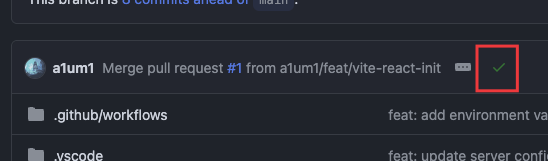

# CE385-CUDE

### Table of Contents

1. [Requirements](#requirements)
2. [Getting Start](#getting-start)
3. [Architecture](#architecture)
4. [How to submit PRs](#how-to-submit-prs)
5. [Figma Design Reference](https://www.figma.com/design/SeZZgPfyv1DJ35CLAxOD9A/CE385?node-id=0-1&t=SPkkQCpZsbZwqrcs-1)

### Requirements

- [Node.js v24](https://nodejs.org/en)
- [Docker](https://www.docker.com/)
- [Postman](https://www.postman.com/)
  หรือเครื่องมือ Debug API อะไรก็ได้ที่รองรับ OpenAPI
- [Visual Studio Code](https://code.visualstudio.com/)
  และติดตั้ง Extension ที่แนะนำใน Project นี้
- [Storybook](https://storybook.js.org/)

### Getting Start

```
npm run dev 								# สำหรับรัน Project ในโหมด Development
npm run lint 								# สำหรับตรวจสอบ Code
npm run format:check				# สำหรับตรวจสอบ Fomat Code
npm run openapi:generate		# สำหรับสร้างไฟล์ API สำหรับ Client (ต้องรัน API ด้วย)
npm run docker:up 					# สำหรับรัน Service ฐานข้อมูล บน Docker
```

### Architecture

- Frontend: [Vite + React](https://vite.dev/)
- Backend: [Express.JS](https://expressjs.com/)
- Database: [Postgres 18](https://www.postgresql.org/)
- Storage: S3 Storage Compatible Service (Undecide)
- Judgement Platform: ~~[Judge0](https://github.com/judge0/judge0)~~ [GoJudge](https://github.com/criyle/go-judge)
- Linter & Formatter: [OXC](https://oxc.rs/)

### How to submit PRs

ในการทำงานเราจะล็อค Branch `develop` ไว้ไม่ให้มีการ Push ได้โดยตรง\
และจำเป็นที่จะต้องใช้การสร้าง Branch แยกจาก Develop แล้วเริ่มทำงานจาก Branch ใหม่ และอยากให้คิดเอาไว้ว่า 1 Branch คือ 1 Feature หรือ 1 ข้อใน Sheet เช่น

- ชื่อ Branch `dev/boat`\
  **ไม่ดี** เพราะมันไม่สัมพันธ์กับ Sheet ว่าเราทำอะไร
- ชื่อ Branch `bug/12`\
  **โอเค** เพราะบอกว่าเราจะแก้บัคข้อ 12 ใน Sheet แต่เลขใน Sheet อาจมีการเปลี่ยนได้
- ชื่อ Branch `feat/authentication`\
  **เริ่ด** เพราะมันอธิบายว่า เรากำลังทำ Feature ที่เป็น Authentication

และเมื่อทำเสร็จต้องทำการเปิด Pull Request เพื่อให้ทำการ Peer Review
โดยจะมี 2 ขั้นตอนหลักๆ คือ

**1. Automated Check**

ใน Project จะมีเครื่องมือที่จะตรวจสอบ Code อัตโนมัติในทุกๆ ครั้งที่เรามีการ Push Code ขึ้นมาจะมีการตรวจสอบ
\
ถ้า ✅ ติ็กเขียวแปลว่า โค้ดได้ผ่านการตรวจสอบขั้นแรก\
ถ้า ❌ ติ็กแดงแปลว่า โค้ดยังไม่ผ่านการตรวจสอบขั้นแรก
แปลว่าเราจะต้องแก้ปัญหาก่อน

เราสามารถใช้คำสั่ง `npm run lint`
เพื่อดูปัญหาที่มีได้ในเครื่องตัวเอง ก่อน Push

> [!Note]
> ทำไมถึงต้องทำแบบนี้?\
> เพื่อไม่ให้คุณเขียน Code ที่อ่านยากเกินไป หรือไม่เป็น Format เกินไป\
> และก็จะทำให้การตรวจ Code มันใช้เวลามากขึ้นถ้าคุณเขียน Code ไม่ดี

> [!WARNING]
> ถ้าหากกฏบางอย่างมันมีปัญหา และคิดว่าข้ามได้ อาจจะต้องถามความเห็นของ Team ก่อน และข้ามขั้นตอนนี้ได้

**2. Peer Review**

ทุกครั้งที่มีการเปิด Pull Request จะต้องมีคนอนุมัติ 2 คนที่ไม่ใช่ตัวเอง

**สิ่งที่คนส่งจะต้องทำคือ**

- ต้องอธิบายสิ่งที่เขียน / หลักการทำงานของมัน
- ต้องอธิบายว่ามันมีวิธีอื่นไหม
- ต้องตอบคำถามของผู้ถาม

**สิ่งที่คนตรวจจะต้องทำคือ**

- อ่าน Code ที่แก้มาว่ามีปัญหาอะไรไหม
- ทำความเข้าใจ Code และฟังคำอธิบายของผู้เขียน
- **ถ้าหากมีข้อสงสัย** ให้ถามได้เลย
- **ถ้าหากมีปัญหา** ให้อธิบายปัญหา และ ตัดสินใจว่าจะ ให้กลับไปแก้ หรือ ให้ผ่านก่อนแล้วไปเพิ่มใน Sheet ว่าเป็น Bug ที่จะต้องแก้

Peer review สามารถทำได้ทั้ง Online และ On-Site และก็ 🫂 Be Friendly เราไม่ได้มาฆ่ากัน

> [!Note]
> ทำไมถึงต้องทำแบบนี้?\
> คนที่เขียน Code จะต้องอธิบายให้ทีมเข้าใจได้ว่า Code มันทำอะไรบ้าง?\
> และเป็นการแลกเปลี่ยนความรู้กัน
